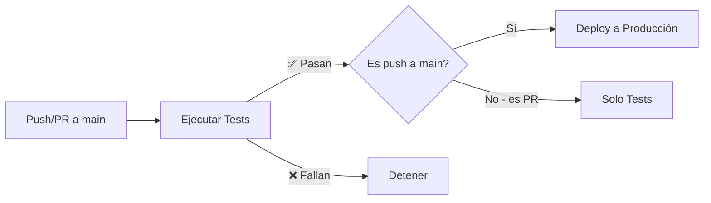

# Migración del Workflow CI/CD

## 📋 Resumen de Cambios

Este documento describe la migración de los workflows de GitHub Actions de dos archivos separados a un único workflow unificado.

## 🔄 Cambios Realizados

### Archivos Eliminados
- ❌ `.github/workflows/main.yml` - Workflow de despliegue simple
- ❌ `.github/workflows/tests.yml` - Workflow de pruebas con despliegue condicional

### Archivos Creados
- ✅ `.github/workflows/ci-cd.yml` - Workflow unificado de CI/CD

## 🎯 Mejoras Implementadas

### 1. Unificación de Workflows
- **Antes**: Dos archivos separados con lógica duplicada
- **Ahora**: Un solo archivo que gestiona todo el pipeline CI/CD
- **Beneficio**: Menor duplicidad, más fácil de mantener

### 2. Flujo de Trabajo Mejorado



**Flujo actual:**
1. Se ejecutan las pruebas en cada push o pull request a `main` o `develop`
2. Si las pruebas pasan Y es un push directo a `main`, se despliega automáticamente
3. Si es un pull request, solo se ejecutan las pruebas (no hay despliegue)

### 3. Documentación Exhaustiva

El nuevo workflow incluye más de 300 líneas de comentarios explicativos que cubren:

- **Configuración de Triggers**: Explicación de cuándo se ejecuta el workflow
- **Job de Tests**: 
  - Configuración de base de datos (MySQL, con instrucciones para PostgreSQL)
  - Instalación de dependencias
  - Ejecución de migraciones
  - Ejecución de pruebas PHPUnit
  - Manejo de errores y logs

- **Job de Deploy**:
  - Condiciones de ejecución (solo en push a main)
  - Configuración de secretos necesarios
  - Comandos de despliegue
  - Alternativas de autenticación SSH (password vs. keys)

- **Personalización por Stack**:
  - Instrucciones para diferentes versiones de PHP
  - Configuración para diferentes bases de datos (MySQL, PostgreSQL, SQLite)
  - Comandos para compilación de assets frontend (npm build)
  - Reinicio de servicios (PHP-FPM, Nginx, supervisorctl)
  - Configuración para diferentes tipos de hosting (VPS, Cloud, Shared)

- **Troubleshooting**: Soluciones a problemas comunes
- **Mejoras Futuras**: Sugerencias de optimización

## 🔒 Seguridad

### Condiciones de Despliegue
El workflow implementa una condición crítica para prevenir despliegues no autorizados:

```yaml
if: github.ref == 'refs/heads/main' && github.event_name == 'push'
```

Esto asegura que:
- ✅ Solo se despliega en la rama `main`
- ✅ Solo se despliega en eventos de tipo `push` (no en PRs)
- ❌ Los pull requests NO activan el despliegue (solo pruebas)

### Secretos Requeridos
El workflow requiere los siguientes secretos configurados en GitHub:
- `HOST` - IP o dominio del servidor VPS
- `USERNAME` - Usuario SSH para el despliegue
- `PASSWORD` - Contraseña SSH (o alternativamente `SSH_PRIVATE_KEY`)

## 📊 Comparación de Workflows

### Workflow Antiguo (main.yml)
```yaml
❌ No ejecutaba pruebas antes del despliegue
❌ Desplegaba directamente sin validación
❌ Sin documentación
❌ Riesgo de desplegar código con errores
```

### Workflow Antiguo (tests.yml)
```yaml
✅ Ejecutaba pruebas
✅ Tenía job de deploy condicional
⚠️ Duplicaba funcionalidad con main.yml
⚠️ Poca documentación
```

### Workflow Nuevo (ci-cd.yml)
```yaml
✅ Ejecuta pruebas obligatoriamente antes del despliegue
✅ Deploy solo si las pruebas pasan
✅ Condición adicional para prevenir deploys en PRs
✅ Documentación exhaustiva (300+ líneas de comentarios)
✅ Instrucciones de personalización para diferentes stacks
✅ Troubleshooting y mejoras futuras documentadas
✅ Un solo archivo para gestionar todo el CI/CD
```

## ⚠️ IMPORTANTE: Status "Skipped" en Pull Requests

### ¿Por qué el job "Deploy to Production" aparece como "skipped"?

Cuando ejecutes este workflow en un Pull Request, verás que el job **Deploy to Production** aparece con el status **"skipped" (omitido)**. 

**Esto es COMPLETAMENTE NORMAL y es el comportamiento ESPERADO.**

### ¿Por qué?

1. **Los PRs son para revisión, no para despliegue**: Los pull requests son oportunidades para revisar código antes de integrarlo a producción. No queremos desplegar código que aún está en revisión.

2. **Seguridad**: Desplegar desde PRs podría permitir que código no revisado llegue a producción, lo cual es un riesgo de seguridad.

3. **Control de calidad**: El despliegue solo debe ocurrir después de que el código haya sido:
   - ✅ Revisado por el equipo
   - ✅ Aprobado por los revisores
   - ✅ Merged a la rama main

### ¿Cuándo se ejecuta el despliegue?

El despliegue se ejecuta **AUTOMÁTICAMENTE** cuando:
1. ✅ Haces merge del PR a la rama `main`
2. ✅ Las pruebas pasan exitosamente
3. ✅ Es un push directo a `main` (no un PR)

### Flujo Visual

```
Pull Request → [Tests: ✅] → [Deploy: ⏭️ Skipped]
     ↓
   Merge
     ↓
Push to main → [Tests: ✅] → [Deploy: 🚀 Ejecutado]
```

### En Resumen

- **En PR**: Tests ✅ | Deploy ⏭️ (skipped) ← Esto es CORRECTO
- **Después de merge a main**: Tests ✅ | Deploy 🚀 ← Aquí se despliega

**No te preocupes si ves "skipped" en PRs. Es exactamente lo que debe pasar.**

## 🚀 Uso del Nuevo Workflow

### Para Desarrolladores

#### Al crear un Pull Request:
1. El workflow se activa automáticamente
2. Se ejecutan las pruebas
3. Si las pruebas pasan: ✅ PR listo para revisión
4. Si las pruebas fallan: ❌ Debes corregir los errores antes del merge
5. **NO se despliega** (solo es un PR)

#### Al hacer Push a main:
1. El workflow se activa automáticamente
2. Se ejecutan las pruebas
3. Si las pruebas pasan:
   - ✅ Las pruebas marcan como exitosas
   - 🚀 Se inicia el despliegue automático a producción
4. Si las pruebas fallan: ❌ El despliegue NO se ejecuta

#### Al hacer Push a develop:
1. El workflow se activa automáticamente
2. Se ejecutan las pruebas
3. Si las pruebas pasan: ✅ OK
4. Si las pruebas fallan: ❌ Debes corregir
5. **NO se despliega** (solo es develop, no main)

### Para Administradores del Proyecto

#### Configuración Inicial
1. Verifica que los secretos estén configurados en GitHub:
   - Settings → Secrets and variables → Actions
   - Añade: `HOST`, `USERNAME`, `PASSWORD`

2. Verifica el environment "production":
   - Settings → Environments → production
   - Configura protection rules si es necesario

3. Primera ejecución:
   - El workflow se ejecutará automáticamente en el siguiente push a main
   - Monitorea la ejecución en la pestaña "Actions"

#### Personalización
Si necesitas ajustar el workflow para tu infraestructura específica:
1. Revisa los comentarios en `.github/workflows/ci-cd.yml`
2. Busca las secciones de "PERSONALIZACIÓN" o "AJUSTES SEGÚN TU STACK"
3. Modifica según tus necesidades (versión PHP, base de datos, comandos de build, etc.)

## ✅ Validación

### Checklist de Migración Completada
- [x] Nuevo workflow `ci-cd.yml` creado
- [x] Workflows antiguos (`main.yml` y `tests.yml`) eliminados
- [x] Sintaxis YAML validada
- [x] Triggers configurados correctamente (push + pull_request)
- [x] Job de tests configurado con base de datos MySQL
- [x] Job de deploy configurado con dependencia en tests
- [x] Condición de despliegue implementada (solo push a main)
- [x] Documentación exhaustiva incluida en comentarios
- [x] Instrucciones de personalización para diferentes stacks
- [x] Troubleshooting documentado
- [x] Secretos documentados

### Próximos Pasos Recomendados
1. ✅ **Merge este PR** para activar el nuevo workflow
2. ⚠️ **Monitorear** la primera ejecución del workflow
3. 📝 **Verificar** que los secretos estén correctamente configurados
4. 🔍 **Revisar** los logs si hay algún problema
5. 🎉 **Disfrutar** del nuevo sistema CI/CD automatizado

## 📚 Referencias

- [GitHub Actions Documentation](https://docs.github.com/en/actions)
- [Laravel Deployment Best Practices](https://laravel.com/docs/deployment)
- [SSH Action Documentation](https://github.com/appleboy/ssh-action)

## 🐛 Soporte

Si encuentras problemas con el nuevo workflow:
1. Revisa la sección de troubleshooting en el archivo `ci-cd.yml`
2. Consulta los logs del workflow en la pestaña "Actions" de GitHub
3. Verifica que los secretos estén configurados correctamente
4. Abre un issue en el repositorio con los detalles del error

---

**Fecha de Migración**: Diciembre 2025  
**Versión del Workflow**: 1.0  
**Autor**: GitHub Copilot
